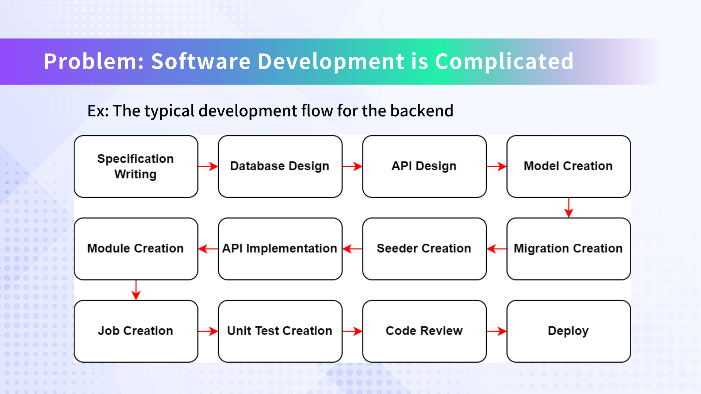

# AI-Powered SaaS Platform for Accelerated Software Development

This platform leverages AI to streamline and accelerate the software development process, offering a revolutionary approach to building software efficiently and cost-effectively.

## Features
- AI-driven development process
- Automated generation of ER diagrams, GraphQL schemas, and more
- Seamless GitHub integration
- Solana blockchain integration for microtransactions
- Rapid prototyping and development
- Cost-effective solution for businesses of all sizes

## Watch Demo First
Click the below image and watch the demo.

<div align="center">
  <a href="https://www.youtube.com/watch?v=m8uNCoP-hec" target="_blank">
    
  </a>
</div>

## Setup and Installation

Our platform consists of two main components: the [Dify](https://dify.ai/) backend and our custom frontend. Follow these steps to set up the development environment:

### 1. Dify Backend Setup

Dify is used as the backend for our AI operations. To set it up locally:

```bash
git clone https://github.com/langgenius/dify
cd dify/docker
cp .env.example .env
docker compose up -d
```

After installation, verify that Dify is running by accessing `http://localhost/apps` in your web browser.

### 2. Frontend Setup

Our frontend is built on top of Dify. To set it up:

```bash
git clone https://github.com/openreachtech/solana-hackathon-demo
cd solana-hackathon-demo
npm install
```

### 3. Environment Configuration

Create a `.furo-env.development` file in the root of the frontend project and add the following environment variables:

```
AI_STEP_1_URL=
AI_STEP_2_URL=
AI_STEP_3_URL=
AI_STEP_4_URL=
AI_STEP_5_URL=
AI_STEP_6_URL=
AI_STEP_7_URL=
```

Fill in the appropriate URLs for each AI step . These should point to your Dify AI agent chat endpoints.

### 4. Running the Development Server

To start the frontend development server:

```bash
npm run dev
```

This will launch the frontend application, which you can access through your web browser at `http://localhost:3000`.

### 5. Connecting Frontend to Backend

Ensure that your Dify backend is running and accessible. The frontend will use the URLs specified in the `.furo-env.development` file to communicate with the AI services.

### Troubleshooting

- If you encounter issues with Dify, check the Docker logs and ensure all containers are running correctly.
- For frontend issues, verify that all dependencies are correctly installed and that the environment variables are properly set.

## Presentation





