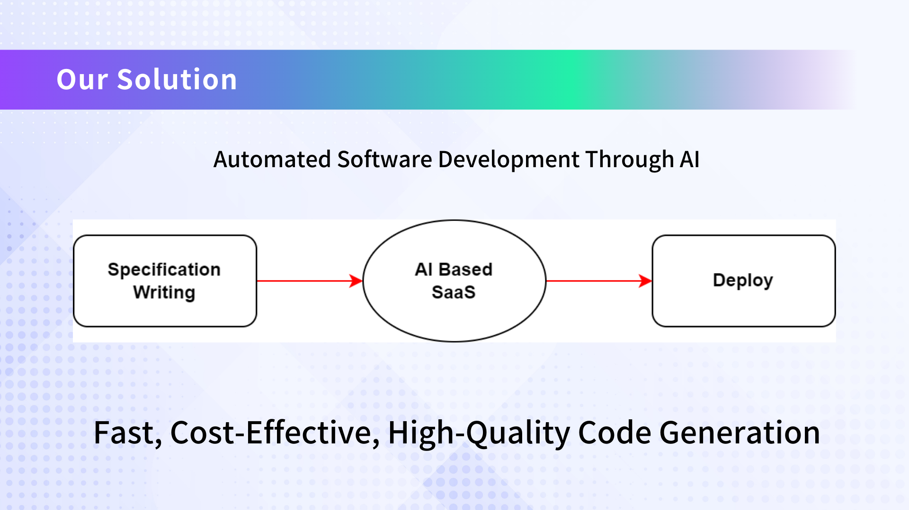
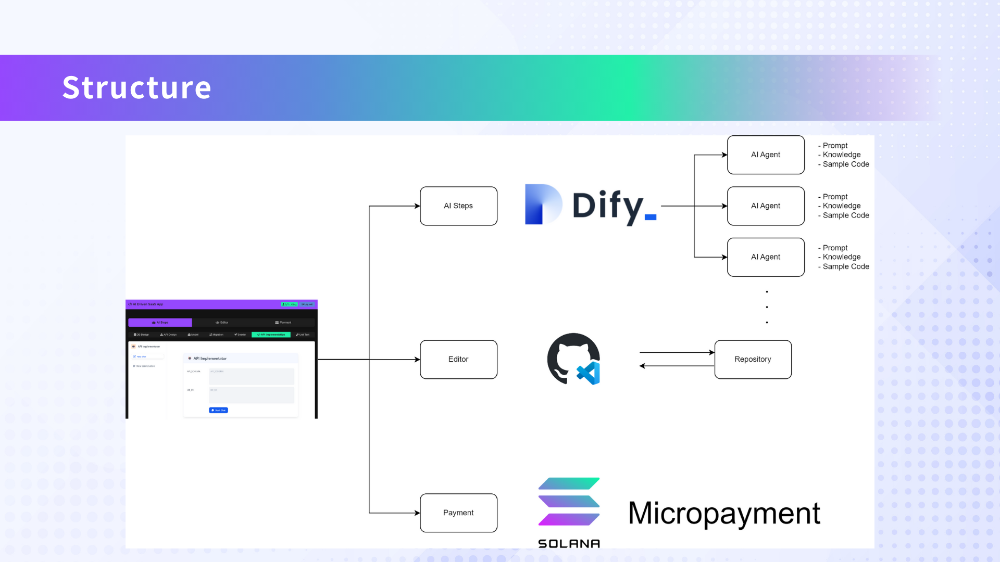

# AI-Powered SaaS Platform for Accelerated Software Development

<iframe width="560" height="315" src="https://www.youtube.com/embed/m8uNCoP-hec?si=dP_IgUYHK_j6ud2I" title="YouTube video player" frameborder="0" allow="accelerometer; autoplay; clipboard-write; encrypted-media; gyroscope; picture-in-picture; web-share" referrerpolicy="strict-origin-when-cross-origin" allowfullscreen></iframe>

This platform leverages AI to streamline and accelerate the software development process. Key components include:

### AI Agents
- Pre-trained for various development stages
- Capable of generating ER diagrams, GraphQL schemas, model files, migrations, seeders, API endpoints, and test code

### Integration
- Seamless GitHub integration for file management
- Solana blockchain integration for payment processing

## Presentation

